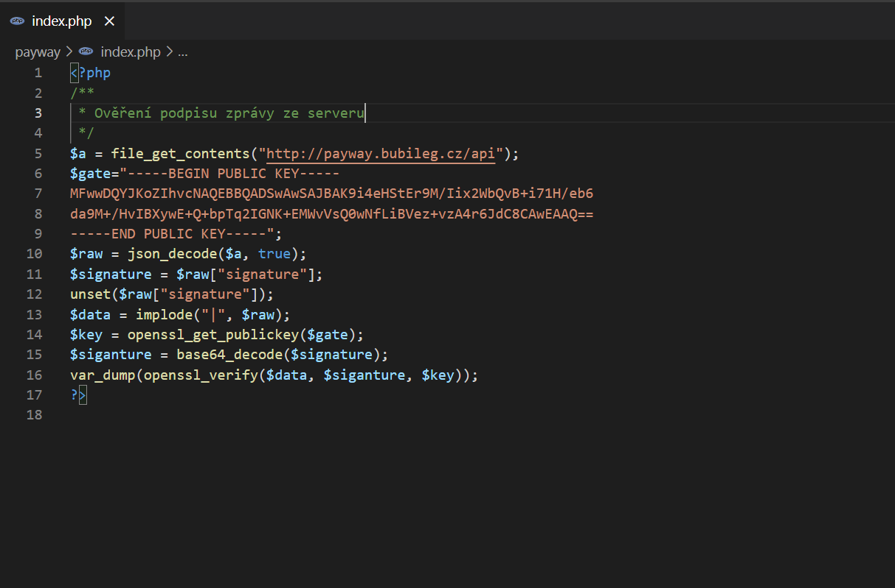
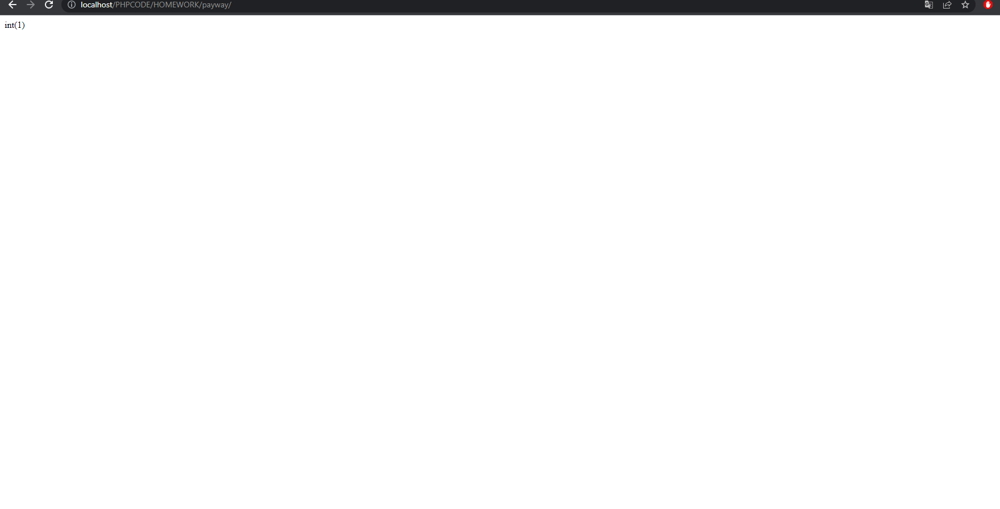
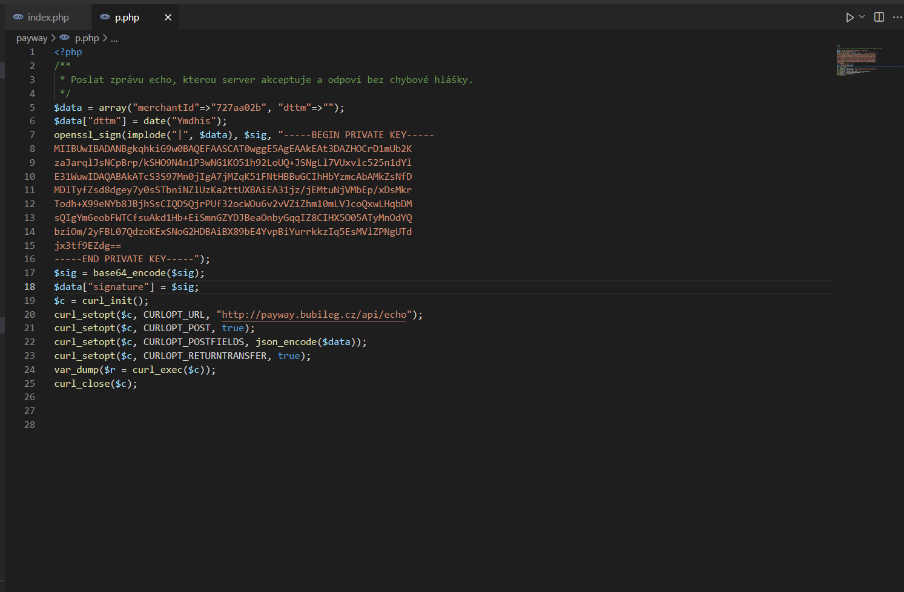
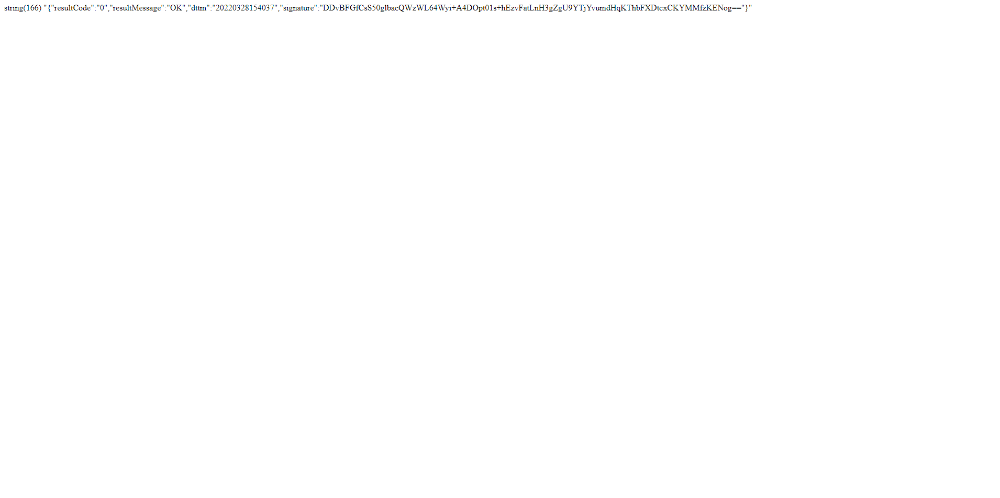

# pay_gateway
V tomto repozitáři najdete 2 zdrojevé kódy.

Kód index.php ověřuje podpis ze serveru.
 
Zdrojový kód:
 

 
Odpověď:
 

Kód p.php posílá echo zprávu na server, na kteror server akceptuje a odpovídá a ní.
 
Zdrojový kód:
 

 
Odpověď:
 

Odpověď:
 

